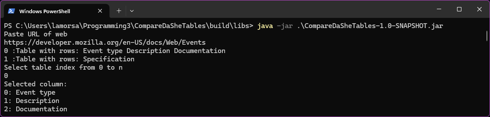
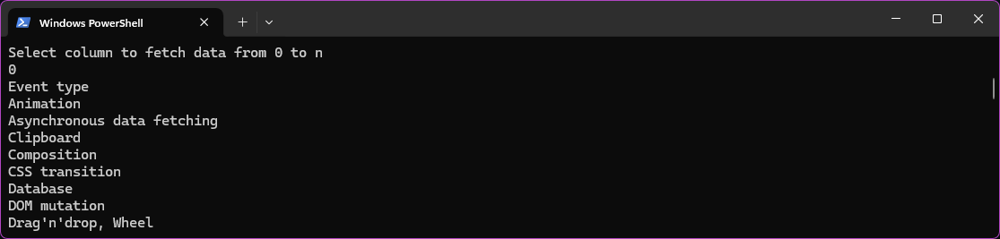
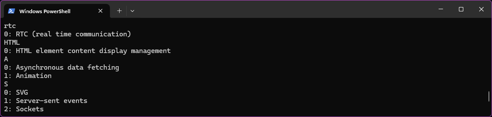
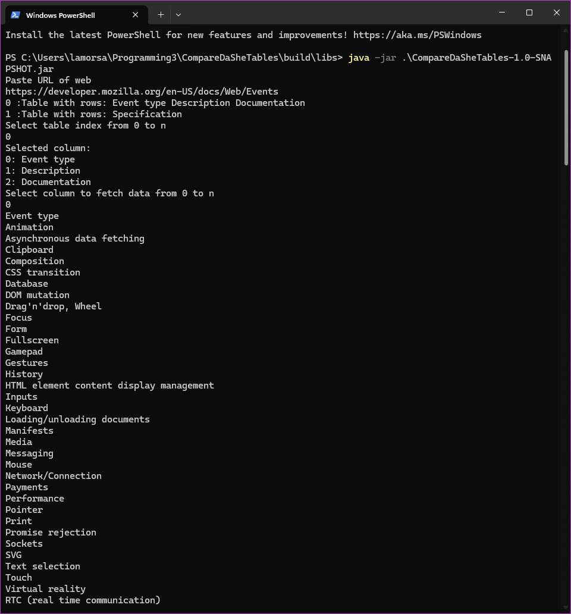
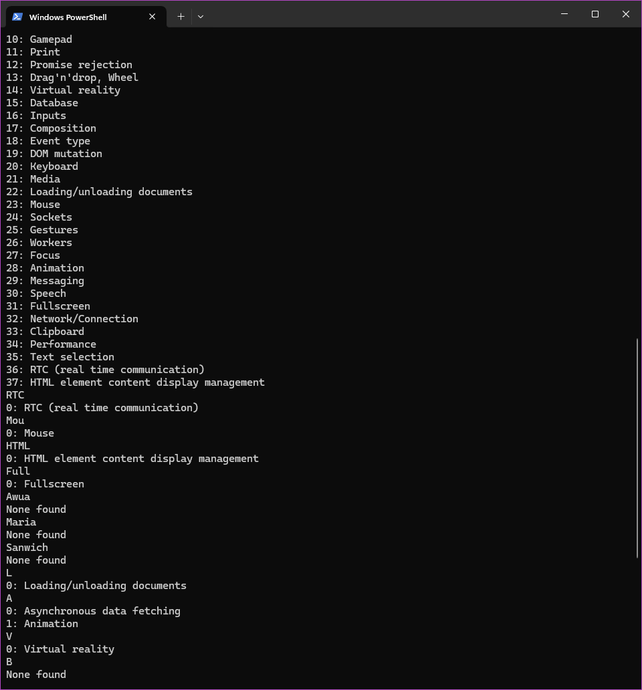

# CompareDaSheTable

Java program that searches from tables in a given web page and select a column of one table you want giving you a quick way to check if some value or data is in the table.
To run the program you need to have java installed and run the command `java -jar jarfile.jar`

And yea. Maybe I should've made a better UI. 

## 1- Paste the URL

## 2- Select the column

## 3- Search

### More examples

